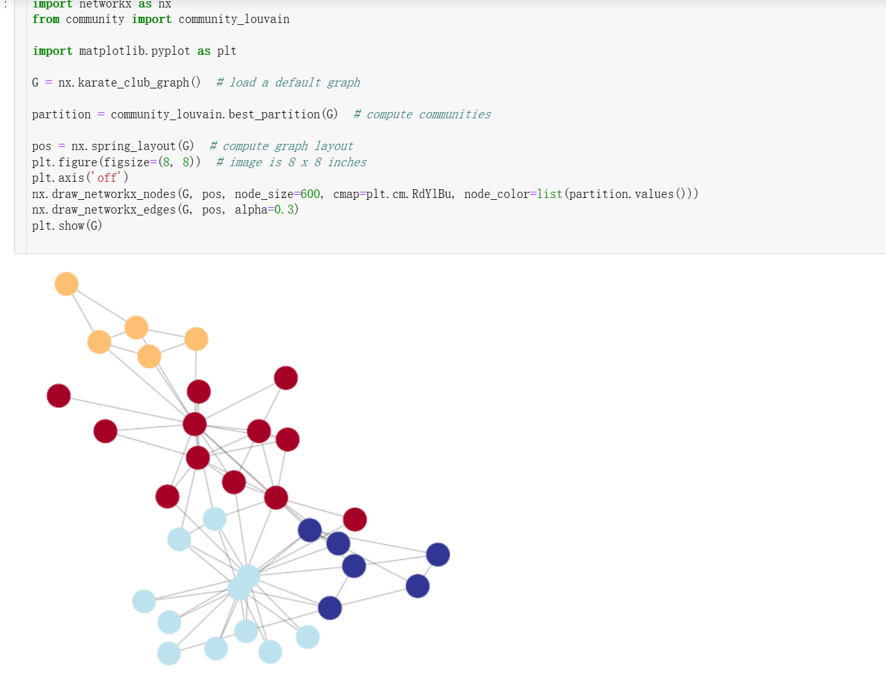

# 社团/社区发现算法学习笔记

## 社区定义

>社交网络中的社区通常是指一个相对独立且密切相关的子集，其中成员之间有着更多的相互联系和交互，而与社区之外的成员之间的联系相对较少。社区可以基于共同的兴趣、活动、背景、文化、地理位置等因素来定义。在社交网络分析中，社区通常是通过分析网络结构、节点的连接方式和社区内外的连接密度等指标来划分的。社区的划分有助于理解网络的结构和功能，也可用于预测节点行为、研究信息传播和社交影响等方面的问题。[悟冥](https://www.zhihu.com/question/59653147/answer/2938555238)


## 应用场景


## Louvain

鲁文算法

Louvain算法是一种基于模块度最大化的社区发现算法。其核心思想是将网络不断划分成更小的社区，并计算每次划分后的模块度值，直到不能再划分为止。

### 模块度


对于一张图中所有已经划分的社区而言，每一个社区的内部的边的权重之和减去所有与社区节点相连的边的权重之和：

$$
\begin{aligned}
\Delta Q & =\left[\frac{\sum_{\text {in }}+k_{i, i n}}{2 m}-\left(\frac{\sum_{\text {tot }}+k_i}{2 m}\right)^2\right]-\left[\frac{\sum_{\text {in }}}{2 m}-\left(\frac{\sum_{\text {tot }}}{2 m}\right)^2-\left(\frac{k_i}{2 m}\right)^2\right] \\
& =\frac{1}{2 m}\left(k_{i, i n}-\frac{\sum_{\text {tot }} k_i}{m}\right)
\end{aligned}
$$


### 实现过程

具体的实现过程如下：

1、初始时将每个顶点当作一个社区，社区个数与顶点个数相同。

2、依次将每个顶点与之相邻顶点合并在一起，计算它们的模块度增益是否大于0，如果大于0，就将该结点放入该相邻结点所在社区。

3、迭代第二步，直至算法稳定，即所有顶点所属社区不再变化。

4、将各个社区所有节点压缩成为一个结点，社区内点的权重转化为新结点环的权重，社区间权重转化为新结点边的权重。

5、重复步骤1-3，直至算法稳定。[「LaoChen_ZeroonE」](https://blog.csdn.net/qq_34356768/article/details/104888579)

Louvain算法的优点是速度快、可扩展性好，适用于大规模网络的社区发现问题。同时，其结果具有较高的质量和稳定性。但是，Louvain算法也存在一些缺点，如对于重叠社区的处理较为困难等。

### 实现

```r

# -*- coding:utf-8 -*-
'''
Created on 2017年9月24日

@summary: Network包调用方法

@author: dreamhome
'''
import community
import matplotlib.pyplot as plt
import networkx as nx

path="/home/dreamhome/network-datasets/football/football.gml"
Graph=nx.read_gml(path)

#输出图信息
print Graph.graph
#输出节点信息
print Graph.nodes(data=True)
#输出边信息
print Graph.edges()
#计算图或网络的传递性
print nx.transitivity(Graph)
#节点个数
print Graph.number_of_nodes()
#边数
print Graph.number_of_edges()
#节点邻居的个数
print Graph.neighbors(1)
# 图划分
part = community.best_partition(Graph)
print part
#计算模块度
mod = community.modularity(part,Graph)
print mod

#绘图
values = [part.get(node) for node in Graph.nodes()]
nx.draw_spring(Graph, cmap=plt.get_cmap('jet'), node_color = values, node_size=30, with_labels=False)
plt.show()
```




## LAP

标签传播算法

标签传播算法(LPA)是一种迭代算法，通过在数据集中传播标签，将标签分配给未标记的点。该算法由Xiaojin Zhu和Zoubin Ghahramani于2002年首次提出。LPA属于转换学习，因为我们要预测已经给出的未标记数据点的标签

(1) 将网络中的每个节点 $x$ 初始化为 $C_x(0)=x$, 即节点 $x$ 在初始阶段的标签为 $x$ 。
(2) 设置 $\mathrm{t}=1$, 表示标签传播算法开始时刻。
(3) 将网络中的节点进行随机排序, 然后放入 $X$ 中。
(4) 定义 $f$ 函数, 表示节点 $x$ 的邻接节点中相同标签数量最大的标签。对于每个 节点 $x \in X$, 使 $C_x(t)=f\left(C_{x_{11}}(t), \ldots C_{x_{i n}}(t), C_{x_{t(n+1)}}(t-1), \ldots, C_{x_{i k}}(t-1)\right)$ 。如果存在多个最大 邻接节点数的标签, 则随机返回其中一种。
(5) 检查每个节点的标签与该节点具有的最多邻接节点的标签。如果每个节点的 标签都与其具有最多邻接节点的标签相同, 则算法停止, 否则 $\mathrm{t}=\mathrm{t}+1$, 继续执行步骤 (3)。

## SLPA

## HANP

## GN

## FN

##