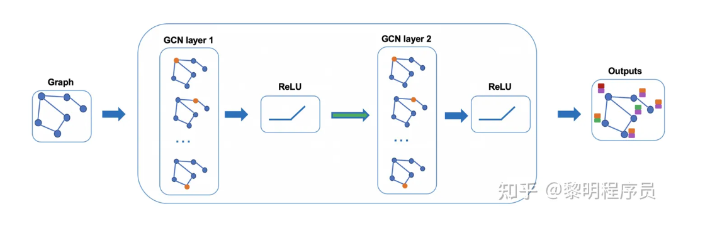

# 图算法

## 基本定义

>定义：图的结构是由顶点和边构成。
规范定义为 图是由顶点的有穷非空集合和顶点之间的边的集合组成，通常表示为： G =（ V , E ）
V是顶点集合，E是边的集合。[霁轩](https://blog.csdn.net/nuo_ss/article/details/124382385)

图 $G=(V, E)$ :
- 节点集 $V$; 节点数量 $n=|V|$;
- 边集 $E$; 边数量 $m=|E|$;
- 邻居矩阵 $A$;
- 度矩阵 $D$;
- 归一化邻接矩阵: $P=D^{-1 / 2} A D^{-1 / 2}$
- 归一化拉普拉斯䞠阵: $L=I-D^{-1 / 2} A D^{-1 / 2}$
- 节点特征矩阵 $X \in \mathcal{R}^{n \times f}, f$ 代表特征维度。

（**注意**：线性表中无元素，则为空表，树中无节点，则为空树，但在图中，顶点数不能为0，边数可以为0。）

### 有向边和无向边、有向图与无向图

两个顶点之间的边的有无方向，判定它为有向无向，

任意两个顶点的边是有向边的图为有向图，同理，为无向图。

### 简单图

简单图就是图中没有环，没有重边（两个顶点存在两条及以上的的边）。
数据结构中讨论的是简单图。

### 邻接、依附

若两个顶点之间有边，则称为这两个点邻接。这个边也依附于这两个点。
（线性表中数据元素仅有线性关系，树中节点有层次关系，图中任意两个点都有可能有关系。）

### 完全图

任意两个顶点之间都存在边。（有向完全图则为任意两个顶点之间存在互相指向的边。）
含n个顶点的完全图有 1/2 ×n（n-1)条边，有向完全图则为它的2倍。

### 稀疏图与稠密图

根据边的多少判断。

### 顶点的度

度有入度和出度，该顶点的度就是依附于该点的边数。入度和出度是有向图里的，指向该点的边数为入度，从该点出发引出的边数则为出度。

### 权图与网图

权是给边赋予有意义的值，
带权的图称为网图。

### 路径、路径长度

从一个顶点到另一个顶点经过的顶点序列，v1v2v3…vi；
路径长度=路径经过的边数（无权），在网图中则为经过边数权值之和。

### 连通图、连通分量

图中任意两个顶点都存在路径，都可达，则称该图为连通图。
非连通图的极大连通子图为连通分量。

### 生成树、生成森林

由图中所有的顶点构成的无回路的连通图。
每个连通分量都可生成树，组成森林。

## 经典图嵌入方法

### deepwalk-2014

DeepWalk是一种基于随机游走的方法生成顶点嵌入的方法。可以分为三步：

第一步：采样。以每个结点为起点随机游走的方式获得一个序列。论文作者认为每个结点进行32~64次游走，每次游走的长度为40.

第二步：训练Skip-gram模型。
每一个结点对应一个embedding向量，然后使用基于分层Softmax框架的Skip-gram模型训练。通常窗口大小为21，即左右各10个。

第三步：获取embedding映射表。

DeepWalk的随机游走方式是完全随机的，有没有更好的策略呢？ Node2vec

### node2vec-2016

### SDNE

### LINE

### pagerank

### struc2vec

## 图神经网络算法

### GCN

图神经网络算法的开山之作~

- image卷积的本质：将图像的局部信息进行提取，或者说对图像中的一个区域进行汇总。

- graph卷积的本质：将结点的邻居（包括自己）的信息进行汇总，然后更新隐向量的过程。[黎明程序员](https://zhuanlan.zhihu.com/p/414839335)

#### 图结构

GCN也可以像CNN一样叠加多层，整体网络结构如下图所示：

#### GCN隐藏层传播

H^{(l+1)}=\sigma\left(\tilde{D}^{-\frac{1}{2}} \tilde{A} \tilde{D}^{-\frac{1}{2}} H^{(l)} W^{(l)}\right

$A$ 波浪 $=A+1$ ，1是单位矩阵，相当于是无向图G的邻接矩阵加上自连接(就是每个顶点和自身加一条边) 如此一来消息聚合时不仅能聚合来自其他结点的消息，还能聚合结点自身的消息。[99.99%](https://blog.csdn.net/weixin_50706330/article/details/127468165)

D波浪是A波浪的度矩阵 (degree matrix)，公式为 $\mathrm{D}$ 波浪 $\mathrm{ii}=\sum \mathrm{jA}$ 波浪（无向图里,节点的度就是节点连接的边的个数。) $\mathrm{H}$ 是每一层的特征，对于输入层的话， $\mathrm{H}$ 就是X (初始就给定的)
$\sigma$ 是像Softmax、ReLU这样的非线性激活函数
$\mathrm{W}$ 就是每一层模型的参数，也就是模型给节点特征乘上的权重，这是模型需要训练的参数，即权值矩阵 他们之间的运算，就是各矩阵相乘，部分内容就长这样：

#### 损失函数

GCN 是一个多层的图卷积神经网络，每一个卷积层仅处理一阶邻域信息，通过叠加若干卷积层可以实现多阶邻域的信息传递。 从输入层开始，前向传播经过图卷积层运算，然后经过softmax激活函数的运算得到预测分类概率分布。 softmax的作用是将卷积网络的输出的结果进行概率化，我直接将Softmax理解为依据公式运算出样本点的类别。 假设我们构造一个两层的 GCN，激活函数分别采用ReLU和Softmax，则整体的正向传播的公式为：

Z=f(X, A)=\operatorname{softmax}\left(\hat{A} \operatorname{ReLU}\left(\hat{A} X W^{(0)}\right) W^{(1)}\right)

该模型实际是输入层+隐藏层（图卷积层，类似全连接层的作用）+SoftMax+输出层构成的，GCN模型可视化为：

GCN输入一个图，通过若干层GCN每个node的特征从X变成了Z，但是，无论中间有多少层，node之间的连接关系，即邻接矩阵A，都是共享的。 

### graphSAGE

### GAT

### HAN

### GTN

### meatpath2vec

### GATNE

### BiNE

### SGCN

### SiGAT

### SDGNN

## 动态图

### DySAT

### Evolve

#### Evolve-O

#### Evolve-H

### DGNN

### TGAT

### HGNN

### DHGNN

