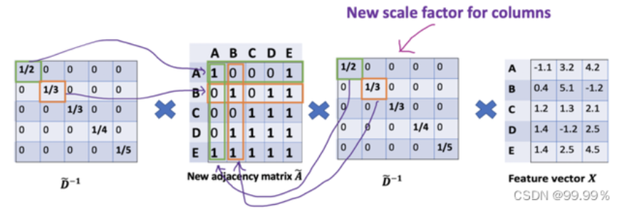

# 图算法

## 基本定义

>定义：图的结构是由顶点和边构成。
规范定义为 图是由顶点的有穷非空集合和顶点之间的边的集合组成，通常表示为： G =（ V , E ）
V是顶点集合，E是边的集合。[霁轩](https://blog.csdn.net/nuo_ss/article/details/124382385)

图 $G=(V, E)$ :
- 节点集 $V$; 节点数量 $n=|V|$;

- 边集 $E$; 边数量 $m=|E|$;

- 邻居矩阵 $A$;

- 度矩阵 $D$;

- 归一化邻接矩阵: $P=D^{-1 / 2} A D^{-1 / 2}$

- 归一化拉普拉斯䞠阵: $L=I-D^{-1 / 2} A D^{-1 / 2}$

- 节点特征矩阵 $X \in \mathcal{R}^{n \times f}, f$ 代表特征维度。

（**注意**：线性表中无元素，则为空表，树中无节点，则为空树，但在图中，顶点数不能为0，边数可以为0。）

### 有向边和无向边、有向图与无向图

两个顶点之间的边的有无方向，判定它为有向无向，

任意两个顶点的边是有向边的图为有向图，同理，为无向图。

### 简单图

简单图就是图中没有环，没有重边（两个顶点存在两条及以上的的边）。
数据结构中讨论的是简单图。

### 邻接、依附

若两个顶点之间有边，则称为这两个点邻接。这个边也依附于这两个点。
（线性表中数据元素仅有线性关系，树中节点有层次关系，图中任意两个点都有可能有关系。）

### 完全图

任意两个顶点之间都存在边。（有向完全图则为任意两个顶点之间存在互相指向的边。）
含n个顶点的完全图有 1/2 ×n（n-1)条边，有向完全图则为它的2倍。

### 稀疏图与稠密图

根据边的多少判断。

### 顶点的度

度有入度和出度，该顶点的度就是依附于该点的边数。入度和出度是有向图里的，指向该点的边数为入度，从该点出发引出的边数则为出度。

### 权图与网图

权是给边赋予有意义的值，
带权的图称为网图。

### 路径、路径长度

从一个顶点到另一个顶点经过的顶点序列，v1v2v3…vi；
路径长度=路径经过的边数（无权），在网图中则为经过边数权值之和。

### 连通图、连通分量

图中任意两个顶点都存在路径，都可达，则称该图为连通图。
非连通图的极大连通子图为连通分量。

### 生成树、生成森林

由图中所有的顶点构成的无回路的连通图。
每个连通分量都可生成树，组成森林。

### 同构图、异构图

- 同构图:[百度文库](https://wenku.baidu.com/view/6bfe8f69862458fb770bf78a6529647d27283400.html?_wkts_=1690811177611&bdQuery=%E5%90%8C%E6%9E%84%E5%9B%BE%E5%92%8C%E5%BC%82%E6%9E%84%E5%9B%BE%E7%9A%84%E5%8C%BA%E5%88%AB)
同构图: 在图里面, 节点的类型和边的类型只有一种的图,
举个例子, 像社交网络中只存在一种节点类型, 用户节点和一种边的类型, 用户-用户之间的连边。

- 异构图:
与同构图相反, 异构图是指图中的节点类型或关系类型多于一种。在现实场景中, 我们通常研究的图数据对象是多类型的, 对象之间的交互 关系也是多样化的。因此, 异构图能够更好地贴近现实。
异构图: 在图里面, 节点的类型+边的类型 $>2$ 的一种图,
举个例子, 论文引用网络中, 存在着作者节点和paper节点, 边的关系有作者-作者之间的共同创作关系连边, 作者-论文之间的从属关系,论文-论文之间的引用关系。

- 属性图:
相较于异构图, 属性图给图数据增加了额外的属性信息, 如下图所示。对于一个属性图而言, 节点和关系都有标签（Label）和属性 (Property)，这里的标签是指节点或关系的类型, 如某节点的类型为 “用户”，属性是节点或关系的附加描述信息, 如 “用户” 节点可 以有“姓名” “注册时间” “注册地址”等属性。属性图是一种最常见的工业级图数据的表示方式, 能够广泛适用于多种业务场景下的数据表达。

- 非显式图:
非显式图是指数据之间没有显式地定义出关系, 需要依据某种规则或计算方式将数据的关系表达出来, 进而将数据当成一种图数据进行研 究。比如计算机3D视觉中的点云数据, 如果我们将节点之间的空间距离转化成关系的话, 点云数据就成了图数据。
其他:
动态图: 图中的节点或者边都是随着时间变化的, 可能增加或减少, 一般是图的构成是按照时间片来构成, 每一个时间片一个图的表示, 例 如 $\mathrm{t} 1$ 时刻的图是初始图, $\mathrm{t} 2$ 时刻的图就是节点或连边变化后的图一直到 $\operatorname{tn}$ 时刻


## 经典图嵌入方法

### deepwalk-2014

DeepWalk是一种基于随机游走的方法生成顶点嵌入的方法。可以分为三步：

第一步：采样。以每个结点为起点随机游走的方式获得一个序列。论文作者认为每个结点进行32~64次游走，每次游走的长度为40.

第二步：训练Skip-gram模型。每一个结点对应一个embedding向量，然后使用基于分层Softmax框架的Skip-gram模型训练。通常窗口大小为21，即左右各10个。

第三步：获取embedding映射表。

DeepWalk的随机游走方式是完全随机的，有没有更好的策略呢？ Node2vec

### node2vec-2016

### SDNE

### LINE

### pagerank

### struc2vec


## 图神经网络算法

### GCN

图神经网络算法的开山之作~

- image卷积的本质：将图像的局部信息进行提取，或者说对图像中的一个区域进行汇总。

- graph卷积的本质：将结点的邻居（包括自己）的信息进行汇总，然后更新隐向量的过程。[黎明程序员](https://zhuanlan.zhihu.com/p/414839335)

#### 图结构

GCN也可以像CNN一样叠加多层，整体网络结构如下图所示：


#### GCN隐藏层传播

$H^{(l+1)}=\sigma\left(\tilde{D}^{-\frac{1}{2}} \tilde{A} \tilde{D}^{-\frac{1}{2}} H^{(l)} W^{(l)}\right)$

其中，：(1) $\tilde{A}=A+I_N$ ，这里指无向图的邻接矩阵，但是添加了自连接（下图中的红线），也 就是每个节点也可以指向自己， $I_N$ 代表第 $\mathrm{N}$ 个节点矩阵实体，另外 $\tilde{D}=\sum_j \tilde{A_{i j}}=D+I$ 这 里相当于节点的度加1形成的矩阵 (用这个度矩阵进行归一化)， $W^{(l)}$ 是一个可训练的参数矩 阵，(2) $\sigma(\cdot)$ 代表激活函数，比如 $R E L U(\cdot)=\max (0, \cdot)$ ；(3) $H^l \in R^{N \times D}$ 代表 $l^{\text {th }}$ 层的隐 向量矩阵， $H^0=X$ ；

$A$ 波浪 $=A+1$ ，1是单位矩阵，相当于是无向图G的邻接矩阵加上自连接(就是每个顶点和自身加一条边) 如此一来消息聚合时不仅能聚合来自其他结点的消息，还能聚合结点自身的消息。[99.99%](https://blog.csdn.net/weixin_50706330/article/details/127468165)


D波浪是A波浪的度矩阵 (degree matrix)，公式为 $\mathrm{D}$ 波浪 $\mathrm{ii}=\sum \mathrm{jA}$ 波浪（无向图里,节点的度就是节点连接的边的个数。) $\mathrm{H}$ 是每一层的特征，对于输入层的话， $\mathrm{H}$ 就是X (初始就给定的)
$\sigma$ 是像Softmax、ReLU这样的非线性激活函数
$\mathrm{W}$ 就是每一层模型的参数，也就是模型给节点特征乘上的权重，这是模型需要训练的参数，即权值矩阵 他们之间的运算，就是各矩阵相乘，部分内容就长这样：



#### 损失函数

GCN 是一个多层的图卷积神经网络，每一个卷积层仅处理一阶邻域信息，通过叠加若干卷积层可以实现多阶邻域的信息传递。 从输入层开始，前向传播经过图卷积层运算，然后经过softmax激活函数的运算得到预测分类概率分布。 softmax的作用是将卷积网络的输出的结果进行概率化，我直接将Softmax理解为依据公式运算出样本点的类别。 假设我们构造一个两层的 GCN，激活函数分别采用ReLU和Softmax，则整体的正向传播的公式为：

Z=f(X, A)=\operatorname{softmax}\left(\hat{A} \operatorname{ReLU}\left(\hat{A} X W^{(0)}\right) W^{(1)}\right)

该模型实际是输入层+隐藏层（图卷积层，类似全连接层的作用）+SoftMax+输出层构成的，GCN模型可视化为：


GCN输入一个图，通过若干层GCN每个node的特征从X变成了Z，但是，无论中间有多少层，node之间的连接关系，即邻接矩阵A，都是共享的。

倒入数据

```r

import math
import time
import numpy as np
import torch
import torch.nn as nn
import torch.optim as optim
import torch.nn.functional as F
import scipy.sparse as sp
import argparse

def encode_onehot(labels):
	"""使用one-hot对标签进行编码"""
    classes = set(labels)
    classes_dict = {c: np.identity(len(classes))[i, :] for i, c in
                    enumerate(classes)}
    labels_onehot = np.array(list(map(classes_dict.get, labels)),
                             dtype=np.int32)
    return labels_onehot

def normalize(mx):
    """行归一化"""
    rowsum = np.array(mx.sum(1))
    r_inv = np.power(rowsum, -1).flatten()
    r_inv[np.isinf(r_inv)] = 0.
    r_mat_inv = sp.diags(r_inv)
    mx = r_mat_inv.dot(mx)
    return mx

def sparse_mx_to_torch_sparse_tensor(sparse_mx):
    """将一个scipy sparse matrix转化为torch sparse tensor."""
    sparse_mx = sparse_mx.tocoo().astype(np.float32)
    indices = torch.from_numpy(
        np.vstack((sparse_mx.row, sparse_mx.col)).astype(np.int64))
    values = torch.from_numpy(sparse_mx.data)
    shape = torch.Size(sparse_mx.shape)
    return torch.sparse.FloatTensor(indices, values, shape)

def load_data(path="./cora/", dataset="cora"):
    """读取引文网络数据cora"""
    print('Loading {} dataset...'.format(dataset))
    idx_features_labels = np.genfromtxt("{}{}.content".format(path, dataset),
                                        dtype=np.dtype(str)) # 使用numpy读取.txt文件
    features = sp.csr_matrix(idx_features_labels[:, 1:-1], dtype=np.float32) # 获取特征矩阵
    labels = encode_onehot(idx_features_labels[:, -1]) # 获取标签

    # build graph
    idx = np.array(idx_features_labels[:, 0], dtype=np.int32)
    idx_map = {j: i for i, j in enumerate(idx)}
    edges_unordered = np.genfromtxt("{}{}.cites".format(path, dataset),
                                    dtype=np.int32)
    edges = np.array(list(map(idx_map.get, edges_unordered.flatten())),
                     dtype=np.int32).reshape(edges_unordered.shape)
    adj = sp.coo_matrix((np.ones(edges.shape[0]), (edges[:, 0], edges[:, 1])),
                        shape=(labels.shape[0], labels.shape[0]),
                        dtype=np.float32)

    # build symmetric adjacency matrix
    adj = adj + adj.T.multiply(adj.T > adj) - adj.multiply(adj.T > adj)

    features = normalize(features)
    adj = normalize(adj + sp.eye(adj.shape[0]))

    idx_train = range(140)
    idx_val = range(200, 500)
    idx_test = range(500, 1500)

    features = torch.FloatTensor(np.array(features.todense()))
    labels = torch.LongTensor(np.where(labels)[1])
    adj = sparse_mx_to_torch_sparse_tensor(adj)

    idx_train = torch.LongTensor(idx_train)
    idx_val = torch.LongTensor(idx_val)
    idx_test = torch.LongTensor(idx_test)

    return adj, features, labels, idx_train, idx_val, idx_test
    
```

GCN框架

```r
class GCNLayer(nn.Module):
	"""GCN层"""
    def __init__(self,input_features,output_features,bias=False):
        super(GCNLayer,self).__init__()
        self.input_features = input_features
        self.output_features = output_features
        self.weights = nn.Parameter(torch.FloatTensor(input_features,output_features))
        if bias:
            self.bias = nn.Parameter(torch.FloatTensor(output_features))
        else:
            self.register_parameter('bias',None)
        self.reset_parameters()

    def reset_parameters(self):
    	"""初始化参数"""
        std = 1./math.sqrt(self.weights.size(1))
        self.weights.data.uniform_(-std,std)
        if self.bias is not None:
            self.bias.data.uniform_(-std,std)

    def forward(self,adj,x):
        support = torch.mm(x,self.weights)
        output = torch.spmm(adj,support)
        if self.bias is not None:
            return output+self.bias
        return output

class GCN(nn.Module):
	"""两层GCN模型"""
    def __init__(self,input_size,hidden_size,num_class,dropout,bias=False):
        super(GCN,self).__init__()
        self.input_size=input_size
        self.hidden_size=hidden_size
        self.num_class = num_class
        self.gcn1 = GCNLayer(input_size,hidden_size,bias=bias)
        self.gcn2 = GCNLayer(hidden_size,num_class,bias=bias)
        self.dropout = dropout
    def forward(self,adj,x):
        x = F.relu(self.gcn1(adj,x))
        x = F.dropout(x,self.dropout,training=self.training)
        x = self.gcn2(adj,x)
        return F.log_softmax(x,dim=1)
```


模型评估

```r
def accuracy(output, labels):
    preds = output.max(1)[1].type_as(labels)
    correct = preds.eq(labels).double()
    correct = correct.sum()
    return correct / len(labels)

def train_gcn(epoch):
    t = time.time()
    model.train()
    optimizer.zero_grad()
    output = model(adj,features)
    loss = F.nll_loss(output[idx_train],labels[idx_train])
    acc = accuracy(output[idx_train],labels[idx_train])
    loss.backward()
    optimizer.step()
    loss_val = F.nll_loss(output[idx_val],labels[idx_val])
    acc_val = accuracy(output[idx_val], labels[idx_val])
    print('Epoch: {:04d}'.format(epoch+1),
          'loss_train: {:.4f}'.format(loss.item()),
          'acc_train: {:.4f}'.format(acc.item()),
          'loss_val: {:.4f}'.format(loss_val.item()),
          'acc_val: {:.4f}'.format(acc_val.item()),
          'time: {:.4f}s'.format(time.time() - t))


def test():
    model.eval()
    output = model(adj,features)
    loss_test = F.nll_loss(output[idx_test], labels[idx_test])
    acc_test = accuracy(output[idx_test], labels[idx_test])
    print("Test set results:",
          "loss= {:.4f}".format(loss_test.item()),
          "accuracy= {:.4f}".format(acc_test.item()))

if __name__ == '__main__':
    # 训练预设
    parser = argparse.ArgumentParser()
    parser.add_argument('--no-cuda', action='store_true', default=False,
                        help='Disables CUDA training.')
    parser.add_argument('--fastmode', action='store_true', default=False,
                        help='Validate during training pass.')
    parser.add_argument('--seed', type=int, default=42, help='Random seed.')
    parser.add_argument('--epochs', type=int, default=200,
                        help='Number of epochs to train.')
    parser.add_argument('--lr', type=float, default=0.01,
                        help='Initial learning rate.')
    parser.add_argument('--weight_decay', type=float, default=5e-4,
                        help='Weight decay (L2 loss on parameters).')
    parser.add_argument('--hidden', type=int, default=16,
                        help='Number of hidden units.')
    parser.add_argument('--dropout', type=float, default=0.5,
                        help='Dropout rate (1 - keep probability).')

    args = parser.parse_args()
    np.random.seed(args.seed)
    adj, features, labels, idx_train, idx_val, idx_test = load_data()
    model = GCN(features.shape[1],args.hidden,labels.max().item() + 1,dropout=args.dropout)
    optimizer = optim.Adam(model.parameters(),lr=args.lr,weight_decay=args.weight_decay)
    for epoch in range(args.epochs):
        train_gcn(epoch)
```


### graphSAGE

严格来说graphsage并不是一种新的图算法，而是一种推导式图学习方法。训练时Graphsage 分为两步：邻居采样和特征聚合。这与普通图算法没有差异，只是训练时对每一个节点构建相应的子图，然后所有子图相同层的权重矩阵共享。邻居聚合时可以选用不同聚合方式，比如图卷积(GCN), 图注意力机制(GAT) 以及最大池化(max pooling) 等，这相当于集大成者。

相比 GCN 和 GAT，预测时graphsage不需要把新节点加入图中更新全图重新训练，而是根据新节点构建子图，然后利用训练得到的各层参数直接计算预测。

>取代原来为每个节点独立训练embedding的方法（原来的transductive 直推式的框架只能对固定的图生成embedding<GCN>，transductive 方法在处理以前从未见过的数据时效果不佳），GraphSAGE采用采样和聚合的方法，是一个inductive（归纳式的框架，归纳式能够处理图中新增的节点，或者通过之前学习的图的知识，用于新图label 的推断上），能够同时利用节点特征信息和结构信息得到Graph Embedding的映射，并且能够高效地利用节点的属性信息对新节点生成embedding。可以同时学习每个节点邻域的拓扑结构以及节点特征在邻域中的分布。
相比之前的方法，之前都是保存了映射后的结果（一次性的，只能学习已经存在的图，不记录转换的过程），而GraphSAGE保存了生成embedding的映射（学习了一个计算函数，泛化能力强），可扩展性更强，对于节点分类和链接预测问题的表现也比较好（动态图）。[Brauch](https://zhuanlan.zhihu.com/p/419827450)

### GAT

真实图中往往包含大量噪声，邻居的相对重要性有差异。GAT 在邻居聚合时给不同邻居赋不同权 重即 “注意力系数” (attention coefficient)，这样在邻居做完加权求和后吸收重要邻居特征，减 少了噪声影响。
注意力系数通过计算邻居节点与目标节点相似度然后通过softmax 归一化得到，如式4
$$
\begin{gathered}
\alpha_{i j}=\operatorname{softmax}_j\left(e_{i j}\right)=\frac{\exp \left(e_{i j}\right)}{\sum_{k \in \mathcal{N}_i} \exp \left(e_{i k}\right)} . \\
\text { 式 (4) }
\end{gathered}
$$
目标节点特征是通过邻居特征与各自注意力系数相乘然后加权求和获得。为捕获更多信息，GAT 中还可以使用多头 attention，如下图10为论文中采用3个 attention头的特征聚合方式。

### HAN

### GTN

### meatpath2vec

### GATNE

### BiNE

### SGCN

### SiGAT

### SDGNN

## 动态图

### DySAT

### Evolve

#### Evolve-O

#### Evolve-H

### DGNN

### TGAT

### HGNN

### DHGNN


